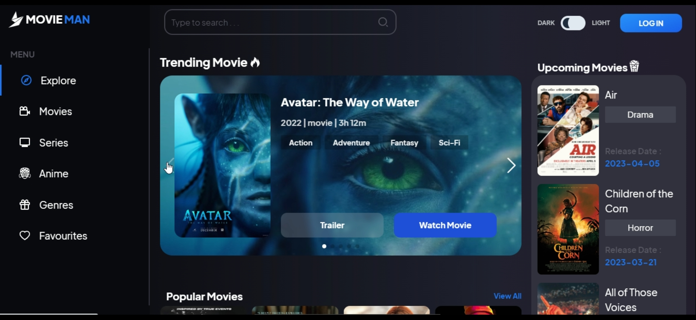
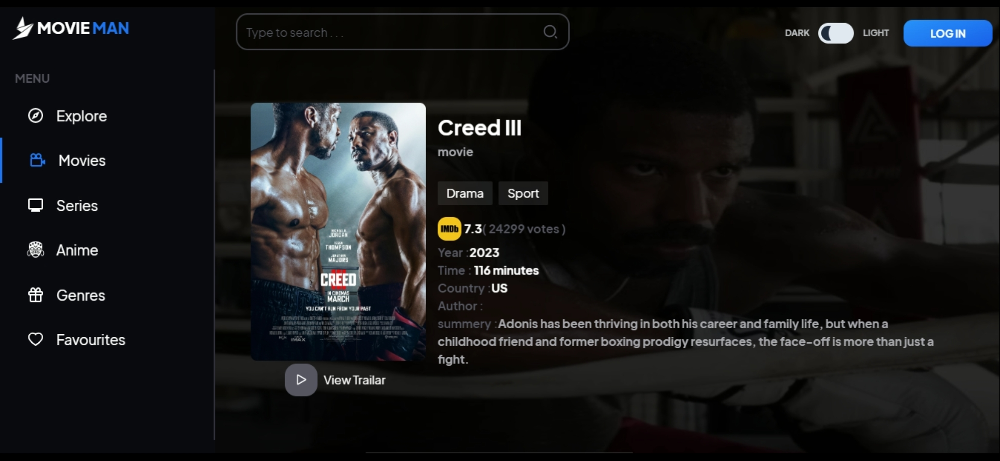

### Hi every one

This page is a movie web application that displays all trending or high-rated movies and series in detail and has the ability to search for all movies.
This page is fully responsive and has the ability to change the theme.
React router dam bend is used.

---

### Languages and Tools:

  
      
       
     
     

   
   
  

---

### 📌Where to find me

  

    

---

